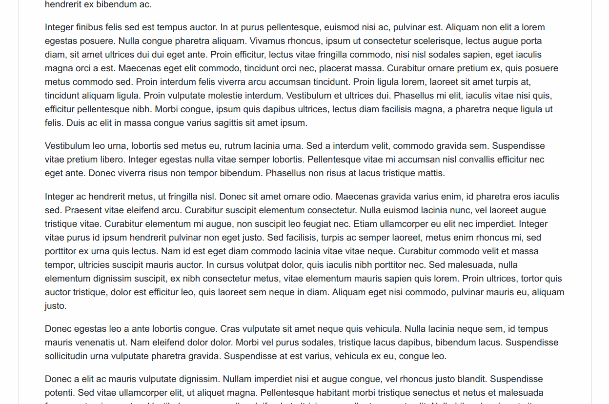

# GitHub Gist Toggle
Just simple "Toggle" button, helpful when you've reach Gist with looooooooong files.

## Features
* Button
* Can be clicked
* Clicked button toggles visibility of file content

## Compatibility
* GreaseMonkey on Firefox
* Tempermonkey on Chrome
* ViolentMonkey on Opera
(not tested in all, but honestly, no hi-tek here)

## Changelog

### 0.1
* Initial release
